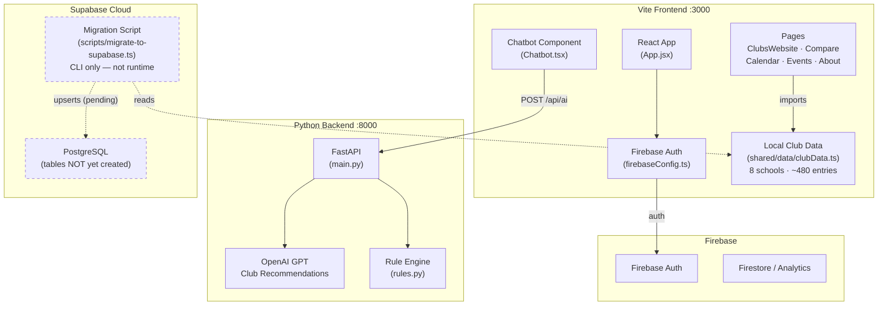

# Technical Architecture Audit — Forsyth County Club Platform

## 1. Data Migration Status

### Schools & Clubs Identified

| Metric | Count |
|---|---|
| Schools parsed from `clubData.ts` | **8** |
| Total club entries (across all schools) | **~480** (some clubs repeated per school) |
| Unique clubs after deduplication | **323** |

**Schools:** East Forsyth, West Forsyth, Lambert, Forsyth Central, Denmark, South Forsyth, North Forsyth, Alliance Academy for Innovation

### Field Mapping: `clubData.ts` → `school_clubs` Junction

| Source Field (`clubData.ts`) | Target Column (`school_clubs`) | Transformation |
|---|---|---|
| `meetingFrequency` + `meetingDay` | `meeting_details` | Concatenated with ` — ` separator |
| `sponsor` | `sponsor_name` | Direct copy, empty string fallback |
| `requirements` | `application_required` | Regex: `/tryout\|audition\|application\|gpa\|nomination/i` → `boolean` |

> [!NOTE]
> Fields like `activities`, `benefits`, and `commitment` are **not migrated** to the junction table — they live in the source data but have no corresponding column in the current schema. They could be added as JSONB columns in a future iteration.

### Slug Generation Logic

```typescript
function slugify(name: string): string {
  return name
    .toLowerCase()
    .replace(/[^a-z0-9]+/g, '-')   // non-alphanumeric → hyphen
    .replace(/(^-|-$)/g, '');       // trim leading/trailing hyphens
}
```

- **Uniqueness enforced** via `UNIQUE` constraint on `clubs.slug` column + `onConflict: 'slug'` upsert
- Example: `"Fellowship of Christian Athletes"` → `fellowship-of-christian-athletes`

---

## 2. Database Integration

### Supabase Client Initialization

> [!CAUTION]
> **No runtime Supabase client exists in the frontend application code.** There is no `src/lib/supabase.ts` or equivalent. The only Supabase client is in the **migration script** (`scripts/migrate-to-supabase.ts`), which is a CLI tool — not imported at runtime.

**Current auth:** Firebase via [firebaseConfig.ts](src/config/firebaseConfig.ts) using `import.meta.env.VITE_FIREBASE_*` variables.

### Environment Variable Handling

| Variable | Location | Used By |
|---|---|---|
| `VITE_SUPABASE_URL` | `frontend/.env` | Migration script only (via `dotenv`) |
| `VITE_SUPABASE_ANON_KEY` | `frontend/.env` | Migration script only (via `dotenv`) |
| `VITE_FIREBASE_*` (7 vars) | `frontend/.env` or inline | `firebaseConfig.ts` via `import.meta.env` |
| `VITE_API_URL` | `frontend/.env` | `Chatbot.tsx` via `import.meta.env` |

> [!IMPORTANT]
> In Vite, only variables prefixed with `VITE_` are exposed to client code via `import.meta.env`. The migration script uses `dotenv` to load them server-side via `process.env`.

---

## 3. Schema Enforcement

### Row Level Security (RLS)

> [!WARNING]
> **RLS has NOT been applied.** No SQL schema has been executed in Supabase yet. The migration script was created but the prerequisite SQL (table creation + RLS policies) was never provided or run. The tables `schools`, `clubs`, and `school_clubs` **do not exist** in Supabase at this time.

**What's needed before migration can run:**

```sql
-- Example schema (must be created in Supabase SQL Editor)
CREATE TABLE schools (
  id UUID DEFAULT gen_random_uuid() PRIMARY KEY,
  name TEXT UNIQUE NOT NULL,
  created_at TIMESTAMPTZ DEFAULT now()
);

CREATE TABLE clubs (
  id UUID DEFAULT gen_random_uuid() PRIMARY KEY,
  name TEXT NOT NULL,
  slug TEXT UNIQUE NOT NULL,
  description TEXT,
  category TEXT,
  created_at TIMESTAMPTZ DEFAULT now()
);

CREATE TABLE school_clubs (
  id UUID DEFAULT gen_random_uuid() PRIMARY KEY,
  school_id UUID REFERENCES schools(id) ON DELETE CASCADE,
  club_id UUID REFERENCES clubs(id) ON DELETE CASCADE,
  meeting_details TEXT,
  sponsor_name TEXT,
  application_required BOOLEAN DEFAULT false,
  created_at TIMESTAMPTZ DEFAULT now(),
  UNIQUE(school_id, club_id)
);
```

### PostgreSQL Triggers

**None implemented.** No `profiles` table or auth trigger exists. The current auth stack is Firebase, not Supabase Auth.

---

## 4. Frontend Impacts

### Components Still Using Local `clubData.ts`

All frontend pages currently import from the **local re-export barrel** at `src/data/clubData.ts`, which re-exports from `src/shared/data/clubData.ts`:

| File | Imports Used |
|---|---|
| [ClubsWebsite.tsx](src/pages/ClubsWebsite.tsx) | `allClubData`, `getClubsBySchool`, `getAvailableSchools` |
| [Compare.tsx](src/pages/Compare.tsx) | `allClubData`, `getClubsBySchool`, `getAvailableSchools` |
| [Calendar.tsx](src/pages/Calendar.tsx) | `allClubData`, `getClubsBySchool`, `getAvailableSchools` |
| [Events.tsx](src/pages/Events.tsx) | `allClubData`, `getClubsBySchool`, `getAvailableSchools` |
| [About.tsx](src/pages/About.tsx) | `allClubData`, `getAvailableSchools` |
| [migrateClubData.ts](src/utils/migrateClubData.ts) | `allClubData` (utility) |
| [dataMigration.ts](src/utils/dataMigration.ts) | `allClubData` (utility) |

> **None of these fetch from Supabase yet.** A future phase would create `src/lib/supabase.ts`, build React Query hooks, and swap these imports.

### Files with TypeScript Errors

| File | Error Count | Nature |
|---|---|---|
| `src/components/__tests__/AuthGuard.test.ts` | 35 | JSX in `.ts` file (should be `.tsx`) |
| `src/components/chatbot/__tests__/SmartClubRecommender.test.ts` | 128 | JSX in `.ts` file (should be `.tsx`) |
| `src/setupTests.ts` | 79 | Missing `@types/jest` / test framework types |
| **Total** | **242** | All pre-existing, unrelated to migration |

> `migrate-to-supabase.ts` and `clubData.ts` — **zero errors**.

---

## 5. Current System Map


